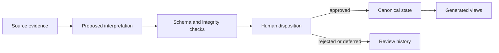

# Architecture

Osito separates durable engineering state from source evidence, review staging, generated output, and agent-specific instructions.

## Logical repository layers

```text
governance
  AGENTS.md, security, contribution, publication policy

configuration
  workspace paths, metadata rules, feature and boundary settings

shared framework
  lifecycle, review, analysis, and maintenance methods

templates and prompts
  blank records and tool-neutral agent task patterns

project workspace
  current records, source evidence, review queue, local indexes

generated views
  dashboards, compiled context, validation and audit reports

local tooling
  setup, validation, audit, and maintenance scripts
```

The framework repository supplies the first four and the tooling. A team chooses whether operational projects live in the same repository or in a separately controlled workspace.

## Suggested workspace

```text
workspace/
├── projects/
│   └── <project-id>/
│       ├── project.md
│       ├── phase-status.md
│       ├── requirements/
│       ├── decisions/
│       ├── risks/
│       ├── actions/
│       ├── validation/
│       ├── changes/
│       ├── research/
│       ├── lessons/
│       ├── meetings/
│       └── reviews/
├── inbox/
├── archive/
└── generated/
```

Exact folders are configurable. Preserve the semantic separation even when names change.

## Authority classes

### Canonical current records

Approved records that describe current requirements, decisions, risks, actions, validation, and status. These are the primary operational source of truth.

### Source evidence

Meeting notes, test observations, research sources, and imported correspondence. Evidence is preserved and linked, but it does not automatically change current state.

### Review staging

Proposed records, extraction sidecars, migration previews, and change sets awaiting disposition. Staging must be clearly noncanonical.

### Generated views

Compiled context, dashboards, indexes, validation reports, and exports. Generated views declare their inputs and should never be edited as a substitute for changing canonical records.

### History

Closed, retired, rejected, and superseded records remain available but are excluded from current-state selection unless a historical task explicitly requests them.

## Source precedence

When information conflicts:

1. approved current structured records;
2. approved decisions and validated evidence;
3. current manifest-backed generated views;
4. source notes and external reports;
5. logs and historical summaries;
6. legacy or superseded records.

Precedence selects authority; it does not erase conflicts. An unresolved conflict should be represented as a review item.

## Record contract

Each meaningful record should have:

- a stable ID;
- a project boundary;
- a controlled type and status;
- creation and update dates;
- an owner or accountable role when applicable;
- provenance;
- related record IDs;
- approval information when required.

See [Metadata schema](../config/metadata-schema.md).

## Change flow



Consequential apply operations should reject stale source or target content, preserve stable IDs, record provenance, and be safe to retry.

## Context boundaries

Every project has a confidentiality boundary. Shared methods and templates may be referenced; other projects may not. An allowed cross-project dependency should identify scope, purpose, approval, and the included records.

Filename similarity, keyword relevance, or AI confidence does not create permission.

## Instruction architecture

Agent instructions should be thin:

```text
agent instruction
    -> shared workflow
    -> template/schema
    -> deterministic tool where available
    -> proposed or approved repository artifact
```

Temporary facts belong in project records, not global instructions. Tool-specific behavior belongs in an optional adapter, not the core workflow.

## Generated-artifact discipline

Generated content should include:

- a generated marker;
- creation time and tool version where practical;
- input or configuration hashes;
- scope and boundary;
- warnings and exclusions;
- a link to a machine-readable manifest when one exists.

Generated output must not become an input to its own regeneration.

## Security model

Repository layout supports review but does not enforce security. Filesystem permissions, repository access, encryption, connector policies, model data handling, backups, and incident response remain deployment responsibilities.

See [Security and privacy](security-and-privacy.md) and [Integrations](integrations.md).
